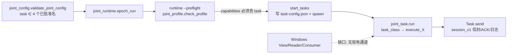

# OMP ArUco → joint 双栈任务接线图（只读核对）

日期：2026-09-11。只读分析，未改任何源码/运行证据；UE 四文件与 aruco_task.py 保持冻结；
未运行 SITL/ROS/UE/MATLAB；未 commit/push；未嵌套。正在运行的主会话产物未触碰。

## 任务入口分流（现状）

- **单机**：`runtime.py:380-385` `default_task = Task`（或 MissionTask），
  `task_factory` 可覆盖 —— 与联合无关，本接线不用它。
- **联合**：`joint_runtime.py:245-252` 每栈 spawn
  `python -B -m Simulator.wksim_runtime.joint_task <task-config.json>`；
  `joint_task.py:41-43` `task_class()` 映射 task_type → JointTask 子类；
  `joint_task.py:111-114` 按 task_type 选择 `execute()`/`execute_velocity_yaw()`。

## 现状能力核对（不冒充已有 aruco capability）

- 已批准联合任务只有 `public_position`、`public_velocity_yaw`、`FIXED_TASKS` 两个
  （`joint_config.py:22-26`）；profile 合同硬编码 capabilities 清单
  （`joint_profile.py:123,128`），`joint_runtime.py:275-276` 拒绝未准入任务。
- `public_velocity_yaw`（`task.py:516-` `execute_velocity_yaw`）用**惯性系 XYZ_VEL**
  ENU + yaw_rate 冻结门，不是机体系相机闭环。
- 公共 body velocity 通路在 Control 候选里已存在：`command.py accept` 支持
  XYZ_VEL_BODY（BODY 集 + `body_command_id_not_increasing` 检查）；已冻结的
  `ArucoCommandAdapter` 输出正是该公共命令 —— **复用的是 Control 既有公共命令
  语义，联合准入清单里没有 aruco 能力，必须新增，不能冒称已准入**。

## 可复用的原始记录器（真 CDR/GID）

- `prometheus_control.rc_transport.RCTake`（`rc_transport.py:9-29`）：已安装 Control
  包内原生 `libwksim_rc_take.so`，`raw=True` 订阅 + take 返回**原始 CDR 字节、
  publisher GID、source/received 时间戳**——非 serialize(decoded)。
- 记录模式：`rc_task.py:47-99`（raw_node + RCTake 排空 + `rc-dds.jsonl`，
  含 `cdr_hex`/`publisher_gid`/双时间戳/decoded 对照）；gnss/global 审计
  （`audit_gnss_flight.py:177-180`、`audit_global_flight.py:80-84`）对
  rc-dds.jsonl 做 CDR 重解码与 decoded 逐字段核对——该审计约定可直接沿用。
- 联合侧已有 supervisor 级原始记录：`joint_monitor.py:29-30`（逐 tick cdr_hex）、
  `joint_lifecycle.py:39,79`（ack/permission 原始 CDR）。任务级 v2/command 的
  CDR/GID 记录需由新任务类按 rc_task 模式补挂。

## 最小源码修改点（具体文件预约）

1. `Simulator/wksim_runtime/joint_config.py:22-26`：批准新任务名
   （建议 `aruco_tracking_v1`），可选字段携带冻结接缝/相机配置身份与观测文件路径；
   不借用 `public_velocity_yaw` 名义。
2. `Simulator/wksim_runtime/joint_profile.py:117-133` + `joint-profiles.json`：
   新 profile 行或合同扩展，把 `aruco_tracking_v1` 列入 capabilities 并绑定
   实际 Control/固件/模型 manifest；在真实运行证据产生前这是**候选准入**。
3. `Simulator/wksim_runtime/joint_task.py`：`task_class` 增加映射 +
   `run()` 增加分支（`:107-114`），新 `JointArucoTask(JointTask)`：
   hover 就绪后按主会话的 View 启用路径开始消费观测文件；复用已冻结
   `ArucoTrackingSeam` + `ArucoCommandAdapter`（`last_command_id` 取
   `joint_task.py:98` ready.json 已记录的 `request_high_water` 对应的宿主
   command_id 高水位——注意 ready.json 记的是 request 号，command_id 高水位需
   任务内自备来源）；每权威步 `process(record, authority_step=<当前步>)`。
4. 任务级原始记录：新任务类按 `rc_task.py:47-99` 模式挂 RCTake raw 订阅
   （v2/command、v2/state、text_info + 原生栈通道），产出 `rc-dds.jsonl`；
   Control 候选里的 `libwksim_rc_take.so` 已在准入包内，可复用，不需新原生件。
5. 观测通道（主会话计划路径的唯一缺口）：当前 Reader/Consumer 只被测试和
   console 使用（grep 证实无生产接线）；joint 运行目录在 WSL `/root/...`，View 在
   Windows。需在 `start_tasks` 的 settings 增加观测文件路径字段，由 Windows 侧
   以只读最新观测文件（run/instance/epoch/generation/stream/step/sequence/target
   身份齐全）写入双方可达的 run 私有位置；**本切片不设计该传输**，仅标注
   `joint_runtime.py:247-250` 的 settings 组装点与任务侧读取点。

## 现有 Control 候选/工具对该联合场景的适用性

- `joint-profiles.json` 的 `joint_quad_dds_v1` 绑定 Control workspace
  `/root/wksim-joint-control-FVMjak`；RCTake 库在该准入包内。profile 扩展时须重新
  绑定实际 build.json/SHA（`joint_profile._control`）。
- 审计工具可复用模式：`audit_gnss_flight.py`/`audit_global_flight.py` 的
  CDR 重解码 + decoded 对照 + GID 归属检查；新 aruco 审计器需另写（当前不存在），
  输入 = rc-dds.jsonl + 观测文件序列 + 接缝/适配器关联记录 + 物理真值。
- 不需要新 DDS 入口、新传输框架或新原生库；缺的只是上述 5 处接线与新任务类。
